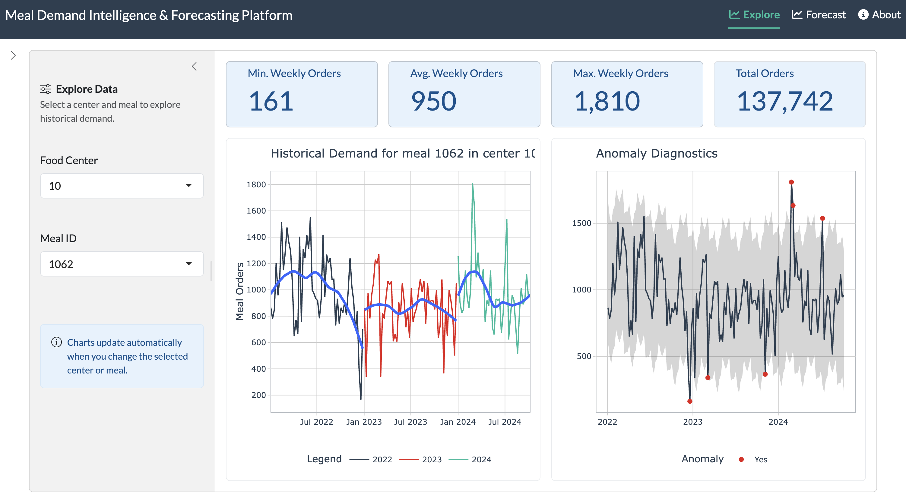

# Meal Demand Intelligence & Forecasting

An interactive R Shiny application for exploring weekly meal demand and generating center–meal forecasts. The project combines historical analysis, anomaly diagnostics, model comparison, uncertainty intervals, and CSV exports in an interactive interface.



## Key features

- Explore demand by fulfilment center and meal.
- Review weekly trends, summary metrics, and unusual observations.
- Compare XGBoost, random forest, radial SVM, K-nearest neighbors, and decision tree models.
- Evaluate candidates using MAE, RMSE, and MAPE on a time-ordered holdout.
- Generate configurable forecasts with prediction intervals.
- Download the source dataset and selected forecast results.

## Dataset

The analysis-ready extract contains 180,815 weekly observations across 76 centers and 40 meals, covering January 2022 through October 2024. It is derived from the [Food Demand Forecasting dataset on Kaggle](https://www.kaggle.com/datasets/kannanaikkal/food-demand-forecasting).

## Technology

R, Shiny, bslib, tidyverse, tidymodels, modeltime, timetk, Plotly, GT, and DT.

## Run locally

Install the packages listed in `global.R`, then run the application from the project directory:

``` r
shiny::runApp()
```

## Project structure

``` text
app.R                 Application shell and navigation
global.R              Dependencies and shared data
utils.R               Forecasting and plotting helpers
R/page_explore.R      Historical demand exploration
R/page_forecast.R     Model comparison and forecasting
R/page_about.R        Project narrative and dataset summary
www/about.css         Responsive About-page styling
data/                 Analysis-ready dataset
```

## Scope

This is a demonstration and exploratory decision-support tool. Production use would require additional data validation, rolling backtests, model monitoring, and relevant operational or external predictors.
